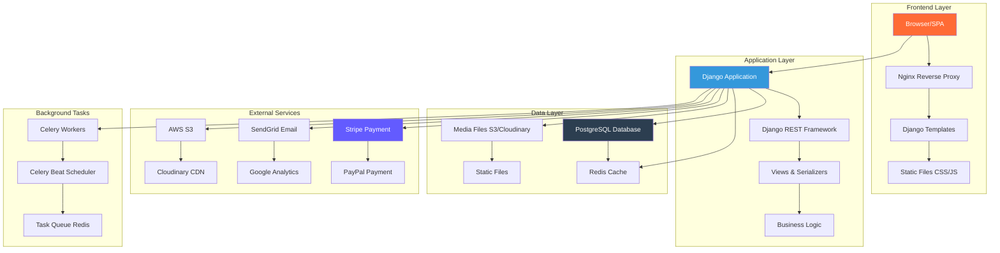
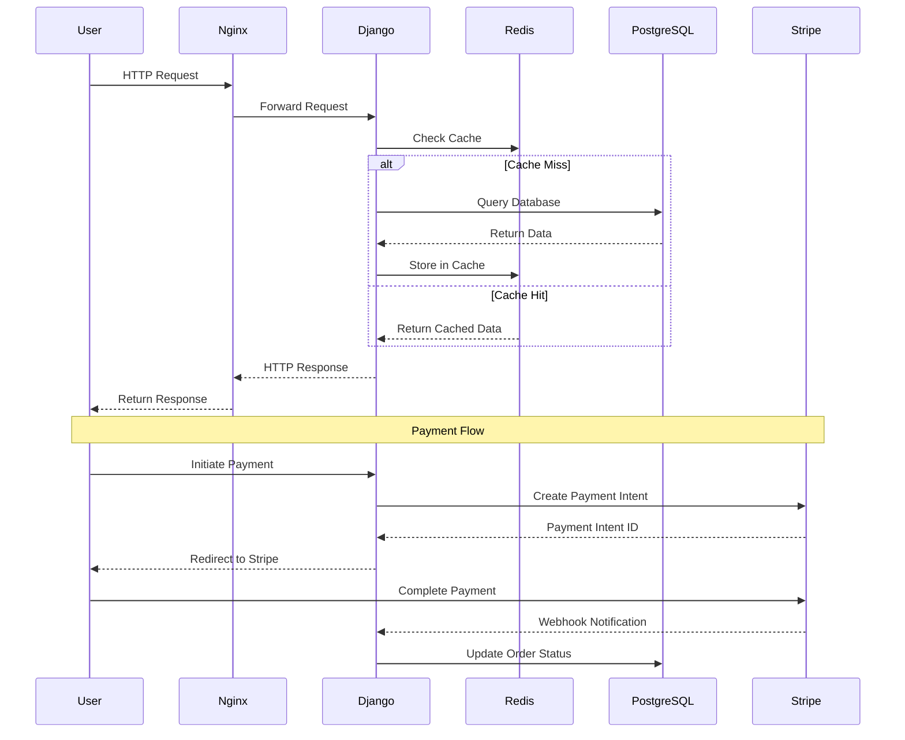
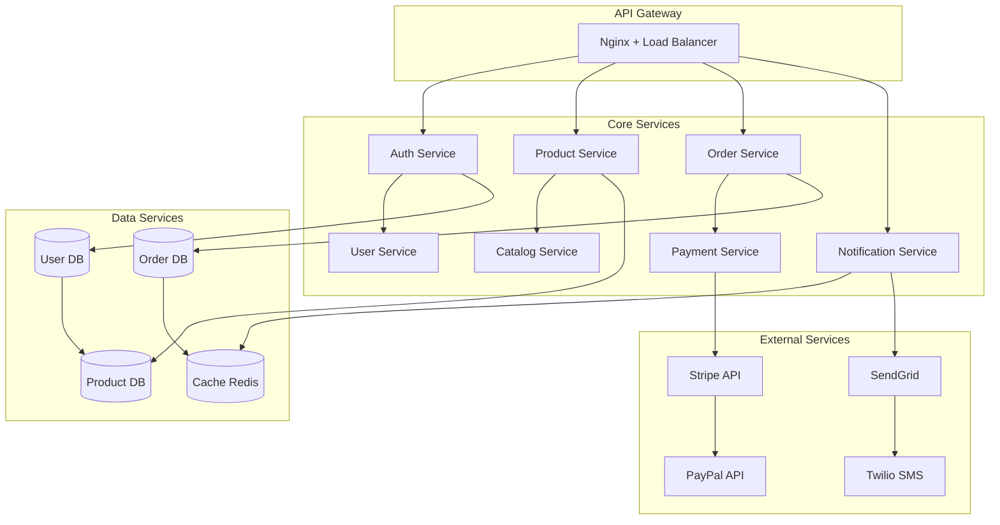
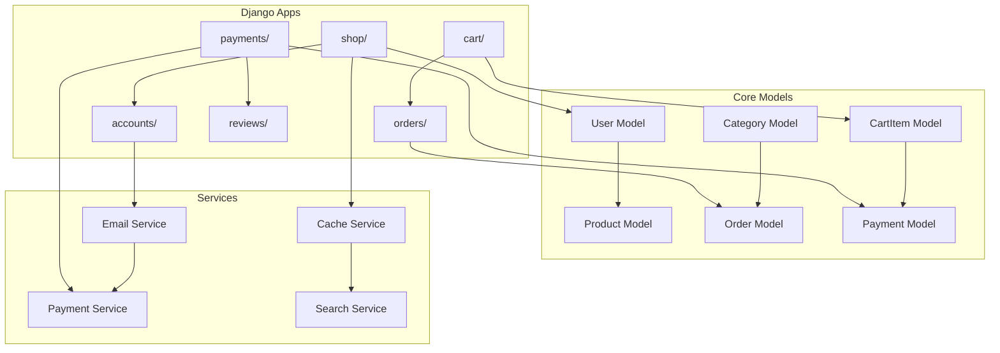
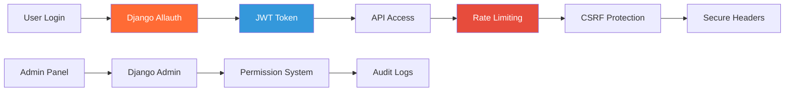
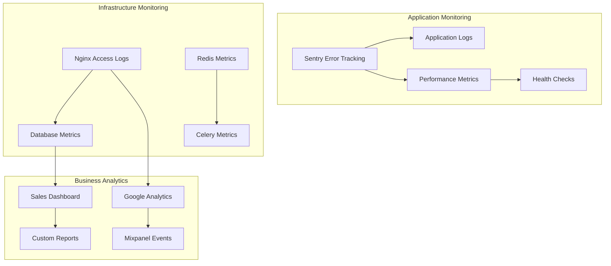
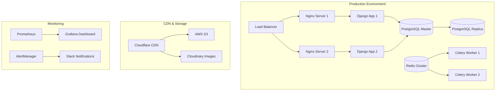

# 🏗️ Архітектура системи Ptashka.shop

## 📊 Діаграма архітектури

## 🔄 Потік даних

## 🏛️ Мікросервісна архітектура (майбутнє)

## 📱 Компонентна архітектура

## 🔐 Безпека та аутентифікація

## 📊 Моніторинг та логування

## 🚀 Deployment архітектура

## 🔄 CI/CD Pipeline

## 📈 Масштабування

### Горизонтальне масштабування:
- **Django Apps**: Load balancer + multiple instances
- **Database**: Read replicas + connection pooling
- **Cache**: Redis cluster with sharding
- **Static Files**: CDN distribution

### Вертикальне масштабування:
- **CPU**: Multi-core processors for Django workers
- **RAM**: Sufficient memory for cache and database
- **Storage**: SSD for database performance
- **Network**: High bandwidth for media delivery

## 🔧 Технічні рішення

### Performance Optimization:
- **Database**: Indexing, query optimization, connection pooling
- **Cache**: Redis for sessions, query results, static data
- **CDN**: Cloudflare for static assets and images
- **Compression**: Gzip/Brotli for responses

### Reliability:
- **Health Checks**: Application and infrastructure monitoring
- **Circuit Breakers**: External service failure handling
- **Retry Logic**: Transient failure recovery
- **Backup Strategy**: Database and media backups

### Security:
- **HTTPS**: SSL/TLS encryption
- **Headers**: Security headers (HSTS, CSP, etc.)
- **Authentication**: JWT tokens with refresh mechanism
- **Authorization**: Role-based access control (RBAC)
